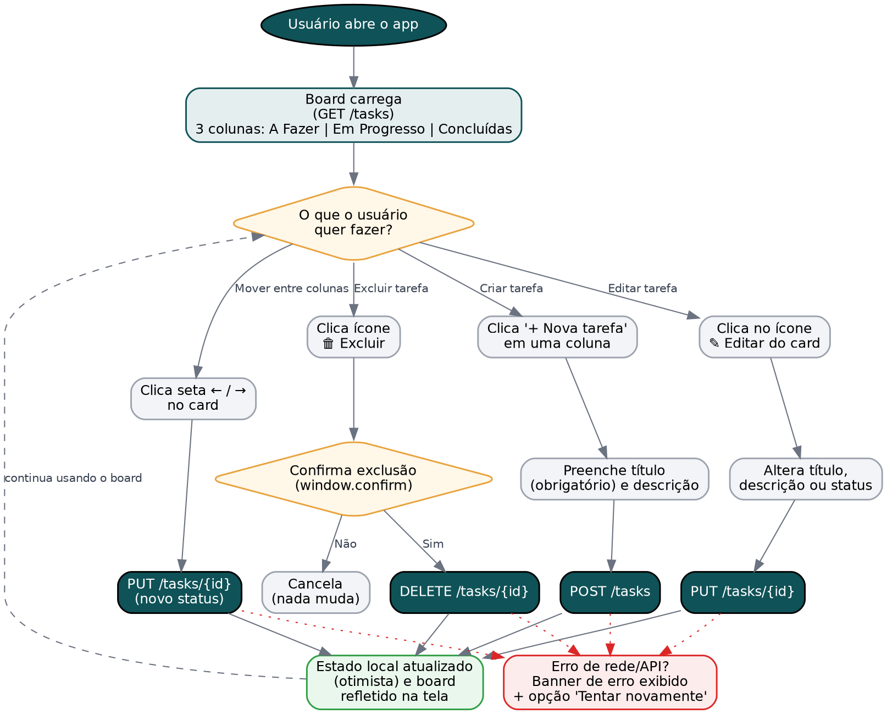

# Mini Kanban de Tarefas — Desafio Fullstack Veritas

Aplicação fullstack de um Kanban simples com três colunas fixas (**A Fazer**, **Em Progresso**, **Concluídas**), desenvolvida como desafio técnico do processo seletivo de estágio em Desenvolvimento Full Stack da Veritas Consultoria Empresarial.

- **Frontend:** React + Vite
- **Backend:** Go (biblioteca padrão `net/http`, sem frameworks externos)

## Diagrama de User Flow



O fluxo cobre as quatro ações principais do usuário — criar, editar, mover e excluir tarefas — e como cada uma se conecta ao backend, incluindo o tratamento de erro.

## Como rodar o projeto

Pré-requisitos: [Go 1.22+](https://go.dev/dl/) e [Node.js 18+](https://nodejs.org/).

### 1. Backend

```bash
cd backend
go run .
```

O servidor sobe em `http://localhost:8080`. Endpoints disponíveis:

| Método | Rota           | Descrição              |
|--------|----------------|-------------------------|
| GET    | `/tasks`       | Lista todas as tarefas |
| POST   | `/tasks`       | Cria uma nova tarefa   |
| PUT    | `/tasks/{id}`  | Atualiza uma tarefa    |
| DELETE | `/tasks/{id}`  | Remove uma tarefa      |
| GET    | `/health`      | Health check           |

### 2. Frontend

Em outro terminal:

```bash
cd frontend
npm install
npm run dev
```

Acesse `http://localhost:5173`. O frontend já está configurado para chamar a API em `http://localhost:8080`.

> **Importante:** o backend precisa estar rodando antes de abrir o frontend, senão a lista de tarefas mostra um erro de conexão (com botão de "Tentar novamente").

## Decisões técnicas

- **Armazenamento em memória** com um `map[string]Task` protegido por `sync.Mutex`, evitando condição de corrida entre requisições concorrentes. Optei por não persistir em arquivo para manter o escopo mínimo simples e focar em fluidez e organização do código.
- **Sem dependências externas no backend** — o roteamento usa o `http.ServeMux` nativo do Go 1.22 (que já suporta `"GET /tasks/{id}"` diretamente no padrão da rota) e os IDs são gerados com `crypto/rand`, evitando a necessidade de baixar pacotes de terceiros.
- **CORS liberado via middleware próprio**, tratando também as requisições `OPTIONS` (preflight) que o navegador dispara antes de `PUT`/`DELETE` com corpo JSON.
- **Movimentação entre colunas por setas (← →) no card**, em vez de drag-and-drop, para manter o MVP simples, acessível (funciona por teclado/clique) e com menos superfície de bugs. Drag-and-drop é listado como *melhoria futura* abaixo.
- **Atualização otimista** no frontend: ao mover ou excluir uma tarefa, a interface já reflete a mudança antes da resposta da API, e desfaz automaticamente se a requisição falhar — melhora a percepção de fluidez.
- **Separação de responsabilidades no frontend**: `api.js` isola as chamadas HTTP, `App.jsx` guarda o estado e a lógica de negócio, e os componentes (`Column`, `TaskCard`, `TaskModal`) só cuidam de exibição.

## Limitações conhecidas

- Os dados são perdidos ao reiniciar o backend (armazenamento em memória, não em arquivo/banco).
- Sem autenticação — qualquer pessoa com acesso à API pode ler/alterar as tarefas.
- Sem testes automatizados.
- Não há drag-and-drop (movimentação é feita pelos botões de seta no card).

## Melhorias futuras

- Persistência em arquivo JSON ou banco de dados (ex: SQLite).
- Drag-and-drop entre colunas.
- Testes automatizados (Go: `net/http/httptest`; React: Vitest + Testing Library).
- Autenticação simples e paginação/filtro de tarefas.
- Dockerizar backend e frontend para subir com um único `docker-compose up`.
