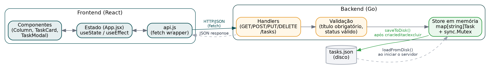

# Mini Kanban de Tarefas — Desafio Fullstack Veritas

Aplicação fullstack de um Kanban simples com três colunas fixas (**A Fazer**, **Em Progresso**, **Concluídas**), desenvolvida como desafio técnico do processo seletivo de estágio em Desenvolvimento Full Stack da Veritas Consultoria Empresarial.

- **Frontend:** React + Vite, com drag-and-drop (`@hello-pangea/dnd`)
- **Backend:** Go (biblioteca padrão `net/http`, sem frameworks), com persistência em arquivo JSON
- **Testes:** `go test` no backend, Vitest + Testing Library no frontend
- **Docker:** `docker-compose` sobe backend e frontend com um único comando

## Diagrama de User Flow


O fluxo cobre as quatro ações principais do usuário — criar, editar, mover e excluir tarefas — e como cada uma se conecta ao backend, incluindo o tratamento de erro.

## Diagrama de Fluxo de Dados



Mostra como os dados trafegam: componentes React → estado (`App.jsx`) → `api.js` → handlers do Go → validação → store em memória → arquivo `tasks.json` em disco.

## Como rodar o projeto

Pré-requisitos: [Go 1.22+](https://go.dev/dl/) e [Node.js 18+](https://nodejs.org/).

### 1. Backend

```bash
cd backend
go run .
```

O servidor sobe em `http://localhost:8080` e carrega automaticamente as tarefas salvas em `tasks.json` (se existir). Endpoints disponíveis:

| Método | Rota           | Descrição              |
|--------|----------------|-------------------------|
| GET    | `/tasks`       | Lista todas as tarefas |
| POST   | `/tasks`       | Cria uma nova tarefa   |
| PUT    | `/tasks/{id}`  | Atualiza uma tarefa    |
| DELETE | `/tasks/{id}`  | Remove uma tarefa      |
| GET    | `/health`      | Health check           |

### 2. Frontend

Em outro terminal:

```bash
cd frontend
npm install
npm run dev
```

Acesse `http://localhost:5173`. O frontend já está configurado para chamar a API em `http://localhost:8080`.

> **Importante:** o backend precisa estar rodando antes de abrir o frontend, senão a lista de tarefas mostra um erro de conexão (com botão de "Tentar novamente").

### 3. Alternativa: rodando tudo com Docker

Se preferir não instalar Go/Node localmente, com [Docker](https://www.docker.com/) instalado:

```bash
docker compose up --build
```

- Frontend: `http://localhost:3000`
- Backend: `http://localhost:8080`

As tarefas ficam salvas em `backend/data/tasks.json` no seu computador (fora do container), graças ao volume configurado no `docker-compose.yml`.

## Testes automatizados

**Backend** (10 testes cobrindo o CRUD, validações e casos de erro):

```bash
cd backend
go test -v ./...
```

**Frontend** (5 testes cobrindo o formulário de tarefas e o carregamento do board):

```bash
cd frontend
npm run test
```

## Decisões técnicas

- **Armazenamento em memória** com um `map[string]Task` protegido por `sync.Mutex`, evitando condição de corrida entre requisições concorrentes.
- **Persistência em arquivo JSON** (`backend/tasks.json`, gerado em tempo de execução): a cada criação/edição/exclusão, o estado inteiro é salvo em disco (`saveToDisk`); ao iniciar, o servidor recarrega esse arquivo (`loadFromDisk`). O caminho do arquivo pode ser configurado pela variável de ambiente `TASKS_FILE` (usada pelo Docker, para salvar em um volume fora do container).
- **Backend sem dependências externas** — o roteamento usa o `http.ServeMux` nativo do Go 1.22 (que já suporta `"GET /tasks/{id}"` diretamente no padrão da rota) e os IDs são gerados com `crypto/rand`, evitando a necessidade de baixar pacotes de terceiros.
- **CORS liberado via middleware próprio**, tratando também as requisições `OPTIONS` (preflight) que o navegador dispara antes de `PUT`/`DELETE` com corpo JSON.
- **Movimentação entre colunas de duas formas**: arrastar e soltar (`@hello-pangea/dnd`) para a experiência principal, e botões de seta (← →) em cada card como alternativa acessível (funciona por teclado/clique, sem depender de mouse).
- **Atualização otimista** no frontend: ao mover ou excluir uma tarefa, a interface já reflete a mudança antes da resposta da API, e desfaz automaticamente se a requisição falhar — melhora a percepção de fluidez.
- **Mensagens de erro amigáveis**: falhas de rede (ex: backend fora do ar) são capturadas em `api.js` e traduzidas em uma mensagem clara para o usuário, em vez do erro cru do navegador (`Failed to fetch`).
- **Separação de responsabilidades no frontend**: `api.js` isola as chamadas HTTP, `App.jsx` guarda o estado e a lógica de negócio, e os componentes (`Column`, `TaskCard`, `TaskModal`) só cuidam de exibição.
- **Roteamento extraído em `newRouter()`** no backend, separado do `main()`, para que os testes usem exatamente as mesmas rotas do servidor real, sem duplicar configuração.
- **Docker multi-stage build**: tanto o backend quanto o frontend compilam em um estágio e rodam em uma imagem final enxuta (Alpine/Nginx), sem o compilador Go ou as devDependencies do Node na imagem final.

## Limitações conhecidas

- Sem autenticação — qualquer pessoa com acesso à API pode ler/alterar as tarefas.
- A persistência é em arquivo JSON local, não em um banco de dados de verdade — não é o ideal para múltiplos usuários simultâneos ou produção.
- O drag-and-drop não reordena tarefas dentro da mesma coluna (só troca de status ao mudar de coluna).

## Melhorias futuras

- Trocar o arquivo JSON por um banco de dados (ex: SQLite ou Postgres).
- Autenticação simples e paginação/filtro de tarefas.
- Reordenação de tarefas dentro da mesma coluna.
- CI (GitHub Actions) rodando os testes automaticamente a cada push.